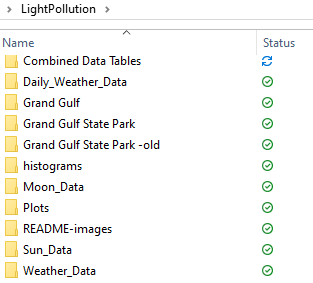
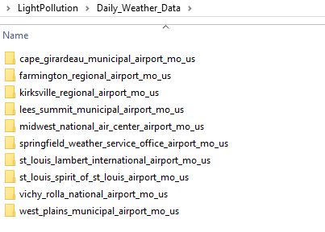
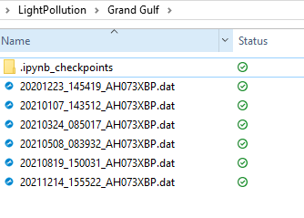
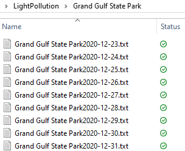
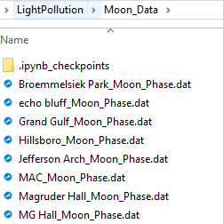
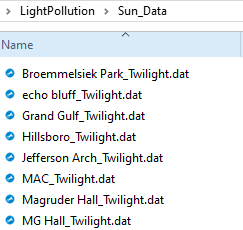
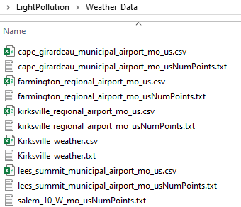

# README

### STARTING OFF Daphne is assuming:
- All the individual data files are formatted and available in the directory.
    - See example images of the directories and compare to the location dictionary (all at the bottom of document!)
    - Use the dz_data_splitter.ipynb to split SQM data by night... in the future that may not be necessary for our method but I'm not messing with that now
---
    
### ONCE YOU HAVE THE DATA, how to combine it:
- the functions.py file has all of the functions and the dictionary
- use the jupyter notebook dz_combine_and_classify.ipynb to make a data table with all of the information stored in a single table 
- this document will also classify intervals and nights as clear or cloudy

### ONCE YOU HAVE A DATA TABLE, how to extract info from it:
- if you want to sort through the table systematically, use the notebook _____ 
- You can make histograms and plots in the notebook **dz_make_plots.ipynb**
    - Histograms are saved in the "histograms" folder of the directory
- You can make a summarizing table using **dz_make_summary_tables.ipynb**
    - Tables can be found in the folder "Summary Tables"

---
### Screenshots to show directory organization/naming conventions

---

### Location Dictionary Entries
location, VIIRS, airport, alt name??, lattitude, longitude, 25 mile population est (maps.ie), 10 pop est, dist to airport km, roof or ground

'Rolla':[19.56,'vichy_rolla_national_airport_mo_us','Physics building Rolla',
                      '37.9549','-91.7722', '112871', '41925', '20', '--']

'MAC':[20.4,'farmington_regional_airport_mo_us','Mineral Area College',
                      '37.845291','-90.482322', '156041', '65512', '11', 'rooftop']

'SEMO':[18.96,'cape_girardeau_municipal_airport_mo_us','Cape Girardeau, MO Rhodes Hall',
                       '37.316192','-89.529771', '129606', '71591', '10', '--']

'Timberlane': [20.95,'midwest_national_air_center_airport_mo_us','Timberlane Obervatory',
                              '39.4128','-94.2417', '421127', '43213', '11', '--']

'Ozark': [20.06,'springfield_weather_service_office_airport_mo_us','Ozark City Hall',
                         '37.021196','-93.205458', '474329', '129921', '30', '--']

'Ozark_II': [20.06,'springfield_weather_service_office_airport_mo_us','Ozark Community Center',
                            '37.022','-93.221', '473062', '143671', '29', 'rooftop']

'Perryville': [20.4,'cape_girardeau_municipal_airport_mo_us','Perryville',
                              '37.720184','-89.852254', '70757', '16930', '60', 'ground']

'Overland': [18.49,'lees_summit_municipal_airport_mo_us','dyoung home',
                            '38.935','-94.589', '1936589', '781331', '19', '--']

'Hillsboro': [20.57,'st_louis_spirit_of_st_louis_airport_mo_us','Jefferson College',
                             '38.265129','-90.558487', '724932', '92316', '46', 'ground']

'Science Center': [17.69,'st_louis_lambert_international_airport_mo_us','McDonnell Planetarium SLSC',
                                  '38.630804','-90.270782', '2240649', '913656', '16', '--']

'Magruder Hall': [19.89,'kirksville_regional_airport_mo_us','Magruder Hall',
                                 '40.187416', '-92.581552', '39215', '24104', '11', 'rooftop']

'MG Hall': [19.89,'kirksville_regional_airport_mo_us','MG Hall',
                           '40.187416', '-92.581552', '39215', '24104', '11', 'rooftop']

'TSO': [20.71,'kirksville_regional_airport_mo_us','TSO',
                       '40.177772', '-92.600972', '39009', '23844', '11', '--']

'Thousand_Hills': [21.25,'kirksville_regional_airport_mo_us','Thousand_Hills',
                                  '40.191832', '-92.6492959', '37965', '23815', '13', 'ground']

'Grand Gulf': [21.89, 'west_plains_municipal_airport_mo_us','Grand Gulf State Park',
                              '36.545278','-91.646131', '61167', '8100', '44', 'ground']

'echo bluff': [21.96, 'west_plains_municipal_airport_mo_us', 'echo bluff',
                              '37.307542','-91.409945', '25193', '646', '65', 'ground']

'Jefferson Arch': [17.38, 'st_louis_lambert_international_airport_mo_us','Gateway Arch National Park',
                                  '38.625732','-90.189310', '2147374', '732211', '21', 'rooftop']

'Broemmelsiek Park': [20.29, 'st_louis_lambert_international_airport_mo_us', 'Broemmelsiek Park',
                                     '38.7197483','-90.8199591', '1045411', '207222', '38', 'rooftop']

---

POST CLEAN:
- check for bad data!
- remove echo bluff data between 2021-09-20 - 2023-01-01
- remove Brom. park data between 2021-05-20 - 2023-01-01

Things I wanna do:
- utilize the flags in characterizing data: if there are multiple weather data, don't have high confidence classification
- make night plot so the red curve turns colors for different classification maybe? Or see what info from flags/classifications may be useful to incorporate in the plot to visualize the info
